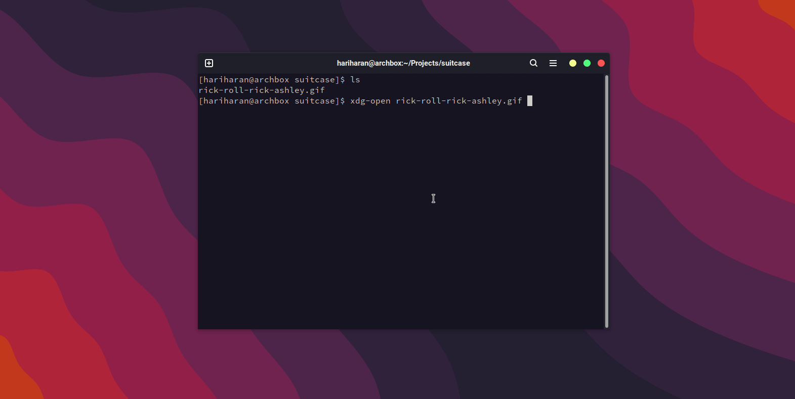

## Suitcase
A self-contained encrypted file. No need for any client-side software to decrypt the file. Uses [age](https://github.com/FiloSottile/age) for encryption.
<p align="center">
    
</p>  

## Usage
Any arbitraty file can be packed into a `suitcase` by specifying the recipient public key. This is the only time a CLI tool is required. Go compiler must be installed.
```bash
suitcase --public-key age1sjcrq8wfgtk2hcgusspmq59asyv4ydlc22rxt8phjs4qqfumxflsymszcz --input input-video.mp4
```

This will generate an executable `secure-case`. The file can be decrypted by running the executable.
```bash
./secure-case -private-key <AGE PRIVATE KEY>
```
By default the contents will be copied to a temporary in-memory file and opened in the default application based on the mime-type. Uses the `memfd_create` syscall to create the in-memory file. You can optionally provide `--output` flag to write the contents to a file.

The file size should be less 2GB.

Currently only works on Linux.